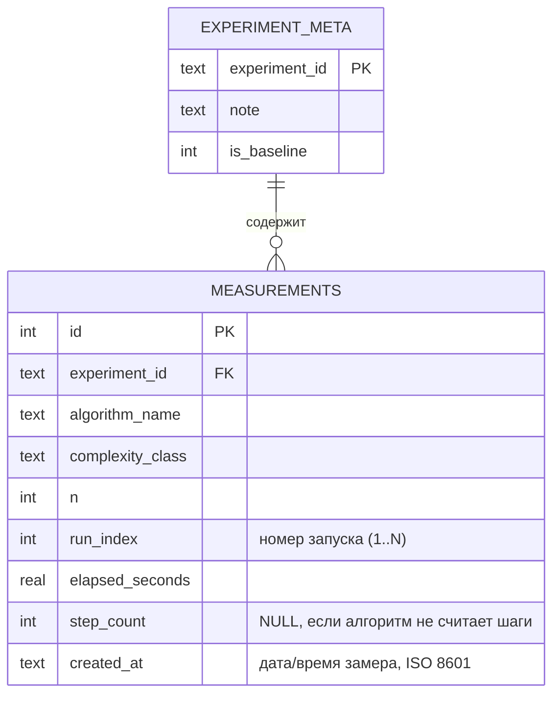

Хорошая новость: в коде (`Storage/BenchmarkDb.cs`) обе вещи уже реализованы правильно — «исправлять» тут почти нечего, дело только в том, чтобы **отразить это в отчёте**, которого пока не видно как отдельного документа. Разберу оба пункта отдельно.

## Пункт 2 — схема БД (номер запуска, дата)

Открыл `BenchmarkDb.cs` — там уже всё есть:

```sql
CREATE TABLE measurements (
    id INTEGER PRIMARY KEY AUTOINCREMENT,
    experiment_id TEXT NOT NULL,
    algorithm_name TEXT NOT NULL,
    complexity_class TEXT NOT NULL,
    n INTEGER NOT NULL,
    run_index INTEGER NOT NULL,      -- ← номер запуска, есть
    elapsed_seconds REAL NOT NULL,
    step_count INTEGER,
    created_at TEXT NOT NULL         -- ← дата эксперимента, есть
);

CREATE TABLE experiment_meta (
    experiment_id TEXT PRIMARY KEY,
    note TEXT,
    is_baseline INTEGER DEFAULT 0
);
```

Т.е. код уже удовлетворяет требованию методички. Проблема была не в коде, а в том, что **этого не видно в отчёте** — методичка требует именно описание схемы БД (ER-диаграмму или таблицу полей) как раздел отчёта. Ничего чинить в приложении не нужно, нужно просто добавить в отчёт готовый кусок. Вот что можно прямо вставить (mermaid-диаграмма, поддерживается GitHub и большинством Markdown→PDF конвертеров):



И короткое текстовое описание рядом (тоже прямо для отчёта):

> Таблица `measurements` хранит один ряд на каждый индивидуальный запуск алгоритма: название алгоритма, теоретический класс сложности, размер входа `n`, порядковый номер повтора `run_index`, измеренное время `elapsed_seconds`, количество шагов `step_count` (для части IV) и метку времени `created_at`. Группировка нескольких запусков одного набора параметров происходит через `experiment_id`, что позволяет сравнивать разные сессии экспериментов (вкладка «Сравнение из истории»). Таблица `experiment_meta` хранит пользовательские заметки и признак «эталонного» прогона.

## Пункт 3 — best/average/worst case по каждому алгоритму

Это тоже не код, а недостающий раздел отчёта (п. 1.5 методички). Проще всего сделать так: добавить в отчёт по одной строке-справке под каждым графиком. Вот готовый набор формулировок под ваши конкретные алгоритмы (можно копировать в блоки 1.5):

| Алгоритм | Best case | Average case | Worst case |
|---|---|---|---|
| f(v)=1 | O(1) | O(1) | O(1) |
| Сумма/произведение элементов | O(n) | O(n) | O(n) |
| Полином наивно | O(n²) | O(n²) | O(n²) |
| Полином Горнер | O(n) | O(n) | O(n) |
| Bubble sort | O(n) *(уже отсортирован, с флагом ранней остановки)* | O(n²) | O(n²) |
| Quick sort | O(n log n) | O(n log n) | O(n²) *(вырожденный выбор опорного элемента)* |
| Timsort | O(n) *(уже отсортирован)* | O(n log n) | O(n log n) |
| Tree sort (BST) | O(n log n) | O(n log n) | O(n²) *(отсортированный вход → «бамбук»)* |
| Radix sort (LSD) | O(n·k) | O(n·k) | O(n·k) *(k — число разрядов, не зависит от порядка данных)* |
| Матричное умножение | O(M²N) | O(M²N) | O(M²N) *(нет зависимости от значений)* |
| Степень простая/рекурсивная (п.10–11) | O(n) | O(n) | O(n) |
| Степень RecPow/QuickPow/QuickPow1 (п.12) | O(log n) | O(log n) | O(log n) |

Важный нюанс, который стоит явно отметить в тексте отчёта: у вас **Tree sort уже экспериментально замерен в двух режимах** (average на случайных данных и worst на отсортированных) — это готовая иллюстрация best/avg/worst, её можно прямо процитировать как подтверждение теории («деградация в X раз соответствует переходу от O(n log n) к O(n²)»). Для Quick sort стоит по аналогии — если хотите усилить отчёт — добавить отдельный замер на уже отсортированном массиве без рандомизации опорного элемента, чтобы наглядно показать worst case O(n²); сейчас, судя по README, замеряется только средний случай на случайных данных.

Если нужно — могу собрать это в единый файл отчёта (Markdown с ER-диаграммой, таблицей best/avg/worst и структурой 1.1–1.6 по каждому алгоритму на основе ваших реальных данных из `results.csv`).